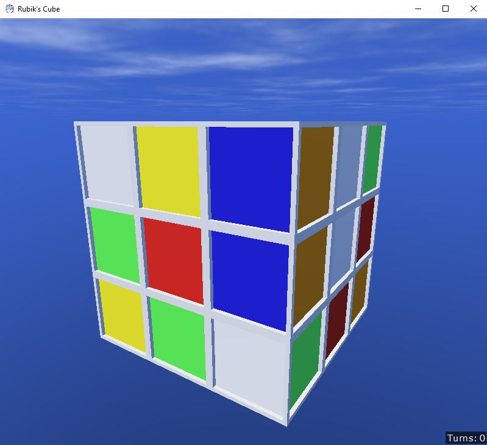

# Rubik's Cube - UI
A program, where you can play with a Rubik's Cube (Zauberwürfel), written in [Rem's Engine](https://github.com/AntonioNoack/RemsEngine) as a sample project.
The logic has been kept as simple as possible to make it easy to understand.

Image, of what the game looks like:

## Controls
The controls are mouse-based only at the moment.
- To turn your camera, move your mouse while pressing the right mouse button.
- To turn a slice of the cube, drag from what cube you want to start from, and where you want it to end.
If there are multiple possibilities, it will choose one randomly (not recommended).